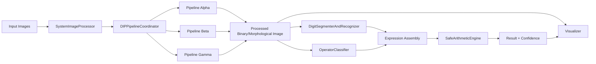
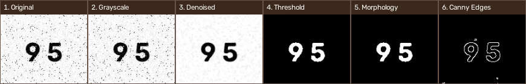
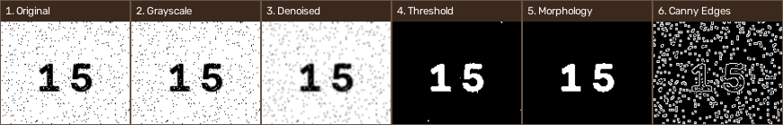
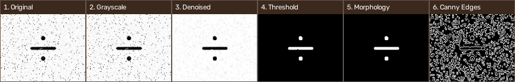

# DIP Image-Based Calculator

> **Digital Image Processing (DIP) — Image-Based Calculator**  
> A computer-vision application that recognizes two numeric operands and an arithmetic operator from noisy images, processes them through an adaptive DIP pipeline, and safely evaluates the resulting expression.

[](https://www.python.org/)
[](https://opencv.org/)
[](https://numpy.org/)
[](https://docs.python.org/3/library/tkinter.html)
[](#license)

## 📌 Overview

**DIP Image-Based Calculator** is an academic Digital Image Processing project that transforms noisy input images into a complete mathematical calculation.

The system accepts three independent images:

1. **Operand 1** — an integer below 100.
2. **Operator** — `+`, `-`, `×`, or `÷`.
3. **Operand 2** — an integer below 100.

The processing flow is:

```text
Input Images
     │
     ▼
Grayscale Conversion
     │
     ▼
Adaptive DIP Pipeline Selection
 ┌─────────┬─────────┬─────────┐
 │ Alpha   │  Beta   │  Gamma  │
 │ Median  │ Gaussian│ CLAHE  │
 │ Otsu    │ Otsu    │ Median │
 │ Close   │ Open    │ Otsu   │
 └─────────┴─────────┴─────────┘
     │
     ▼
Morphological / Edge Processing
     │
     ▼
Connected Components
     │
     ├───────────────┐
     ▼               ▼
Digit Recognition   Operator Recognition
Template Matching   Structure + Template Matching
     │               │
     └───────┬───────┘
             ▼
      Expression Assembly
             │
             ▼
      Safe Arithmetic Engine
             │
             ▼
       Result + Confidence
```

The project intentionally performs the calculation **without `eval()` or `exec()`**.

---

## ✨ Key Features

### 🔬 Digital Image Processing

The implementation demonstrates a complete classical DIP pipeline using:

- Grayscale conversion
- Median filtering
- Gaussian filtering
- CLAHE contrast enhancement
- Otsu thresholding
- Morphological opening
- Morphological closing
- Canny edge detection
- Connected-component analysis
- ROI extraction and normalization

### 🔁 Multi-Pipeline Fallback

Three preprocessing pipelines are evaluated sequentially:

| Pipeline | Processing Chain | Primary Use |
|---|---|---|
| **Alpha** | Median → Otsu → Closing | Impulse/noisy images |
| **Beta** | Gaussian → Otsu → Opening → Closing | Gaussian noise and small artifacts |
| **Gamma** | CLAHE → Median → Otsu → Closing | Low-contrast images |

The system keeps the highest-confidence candidate and can stop early when a sufficiently strong recognition result is obtained.

### 🔢 Digit Recognition

Numbers are recognized using a classical computer-vision approach rather than a neural network:

1. Extract connected components.
2. Remove components below configured area/height thresholds.
3. Normalize each digit ROI to a fixed template size.
4. Sort detected digits from **left to right**.
5. Compare each digit against templates `0–9`.
6. Combine recognized digits into the final integer.
7. Calculate an overall confidence score.

### ➕ Operator Recognition

The supported operators are:

```text
+   -   ×   ÷
```

Recognition combines:

- Structural/topological analysis
- Connected-component geometry
- Aspect-ratio analysis
- Stroke distribution
- Normalized cross-correlation (NCC)
- Intersection over Union (IoU)

The combined template score is:

```text
Score = 0.6 × NCC + 0.4 × IoU
```

Structural evidence can add a confirmation bonus for the detected operator.

### 🧮 Safe Arithmetic Engine

The calculator uses explicit arithmetic handlers:

```text
+  → addition
-  → subtraction
×  → multiplication
÷  → division
```

Security and correctness properties include:

- No `eval()`
- No `exec()`
- Explicit operation dispatch
- Division-by-zero protection
- Input validation
- Clean numeric formatting
- Structured calculation results

### 🖥️ Interactive GUI

The Tkinter interface provides:

- Image selection
- Sample-image loading
- Quick filter preview
- Recognition controls
- Expression/result display
- Confidence information
- Intermediate pipeline visualization

### 🧪 Automated Verification

The included test suite verifies:

- Arithmetic correctness
- Division-by-zero handling
- Recognition of 9 noisy numbers
- Recognition of 4 noisy operators
- End-to-end expression processing
- Original-image immutability in RAM

The included verification suite is designed to produce a **5/5 test-suite pass** on the supplied test data.

> This result refers specifically to the deterministic sample/test set included in the repository; it should not be interpreted as a general-world OCR accuracy benchmark.

---

## 🏗️ Architecture

The recommended implementation is located in:

```text
submission_dip_v2/
```

Its architecture separates image processing, orchestration, recognition, calculation, visualization, testing, and report generation.



### Core modules

| Module | Responsibility |
|---|---|
| `app.py` | Interactive Tkinter GUI |
| `dip_engine.py` | Core DIP operations and connected components |
| `pipeline_manager.py` | Alpha/Beta/Gamma preprocessing orchestration |
| `character_recognizer.py` | Digit segmentation, template matching, operator recognition |
| `processor.py` | High-level system coordinator |
| `safe_calculator.py` | Secure arithmetic evaluation |
| `visualizer.py` | Recognition overlays and processing-stage visualization |
| `dataset_generator.py` | Template and noisy test-image generation |
| `run_tests.py` | Automated verification suite |
| `generate_final_report.py` | Academic report generation |

---

## 📂 Repository Structure

```text
image-calc/
│
├── app.py
├── calculator.py
├── digit_recognizer.py
├── edge_detection.py
├── image_processor.py
├── operator_recognizer.py
├── preprocessing.py
├── segmentation.py
├── visualization.py
├── test_system.py
├── generate_templates.py
├── generate_doc.py
│
├── templates/
│   ├── digits/
│   │   ├── 0.png
│   │   ├── 1.png
│   │   └── ... 9.png
│   └── operators/
│       ├── add.png
│       ├── sub.png
│       ├── mul.png
│       └── div.png
│
├── input/
│   ├── clean samples
│   └── noisy samples
│
├── output/
│   ├── processing results
│   ├── code visualizations
│   └── execution screenshots
│
├── submission_dip_v2/
│   ├── app.py
│   ├── dip_engine.py
│   ├── pipeline_manager.py
│   ├── character_recognizer.py
│   ├── processor.py
│   ├── safe_calculator.py
│   ├── visualizer.py
│   ├── dataset_generator.py
│   ├── run_tests.py
│   ├── generate_final_report.py
│   ├── templates/
│   ├── input/
│   └── output/
│
└── README.md
```

### Which version should I run?

For the **final/refined implementation**, use:

```text
submission_dip_v2/
```

The root-level Python files represent the earlier implementation retained in the repository for comparison and development history.

---

## ⚙️ Requirements

### Software

- Python **3.9 or newer**
- OpenCV
- NumPy
- Pillow
- python-docx
- Pygments
- Tkinter

### Install dependencies

From the `submission_dip_v2` directory:

```bash
pip install opencv-python numpy pillow python-docx pygments
```

> On some Linux distributions, Tkinter must be installed separately through the operating system package manager.

---

## 🚀 Quick Start

### 1. Clone the repository

```bash
git clone <YOUR-REPOSITORY-URL>
cd image-calc
```

### 2. Enter the refined implementation

```bash
cd submission_dip_v2
```

### 3. Launch the GUI

```bash
python app.py
```

The application opens an interactive graphical interface where you can load an image, inspect preprocessing filters, and run recognition/calculation.

---

## 🧪 Run the Test Suite

From `submission_dip_v2/`:

```bash
python run_tests.py
```

The suite contains five verification groups:

```text
1. Safe arithmetic engine
2. Noisy number recognition
3. Noisy operator recognition
4. End-to-end expression calculation
5. RAM immutability verification
```

Expected final status for the supplied deterministic test set:

```text
RESULT: ALL 5/5 TEST SUITES PASSED SUCCESSFULLY (100%)!
```

---

## 🧰 Generate Test Data

The repository includes deterministic generation of:

- Digit templates `0–9`
- Operator templates `+ - × ÷`
- Clean number samples
- Noisy number samples
- Clean operator samples
- Noisy operator samples

Run:

```bash
python dataset_generator.py
```

The generator uses a fixed NumPy seed for reproducibility.

Noise models include:

- Gaussian noise
- Salt-and-pepper noise
- Mixed noise

---

## 🖼️ Visual Results

The repository includes generated visual evidence under:

```text
submission_dip_v2/output/
```

### Execution example



### Additional pipeline examples





> These images are repository-generated artifacts and document intermediate processing stages.

---

## 🔍 Processing Details

### Stage 1 — Input

Three independent images are provided:

```text
Operand 1
Operator
Operand 2
```

Example:

```text
95     ÷     15
```

### Stage 2 — Preprocessing

Each image is converted to grayscale and passed through the fallback pipeline coordinator.

### Stage 3 — Binarization

Otsu thresholding converts the denoised grayscale image into a binary foreground/background representation.

### Stage 4 — Morphological Processing

Opening and closing are used to suppress small artifacts and reconnect useful foreground structures.

### Stage 5 — Edge Analysis

Canny edge detection is performed as an additional structural representation, followed by stray-edge filtering.

### Stage 6 — Segmentation

Connected components are extracted from the processed binary image.

For numbers, valid components are filtered using configured geometric constraints and ordered by their horizontal position.

### Stage 7 — Template Matching

Each normalized character is compared with its corresponding template set.

The digit classifier combines:

```text
NCC + IoU
```

using:

```text
Composite Score = 0.6 × NCC + 0.4 × IoU
```

### Stage 8 — Expression Construction

Recognized values are assembled into:

```text
operand1 operator operand2
```

### Stage 9 — Safe Calculation

The expression is evaluated by explicit arithmetic functions rather than dynamic Python execution.

For example:

```text
95 ÷ 15 = 6.3333
```

Division by zero is handled as an explicit mathematical error.

---

## 🛡️ Design and Reliability Considerations

### No dynamic expression execution

The project deliberately avoids:

```python
eval(...)
exec(...)
```

This prevents arbitrary Python expression execution and keeps the arithmetic layer explicit and auditable.

### Input immutability

The processing pipeline works on derived image arrays and verifies that the original input array is not modified during processing.

### Reproducible test generation

The supplied dataset generator initializes NumPy with a fixed seed:

```python
np.random.seed(101)
```

This makes the generated test set reproducible.

### Confidence-aware recognition

Recognition does not rely only on a class label. The system retains confidence information and uses it when selecting between preprocessing pipelines.

---

## 📊 Included Test Dataset

The refined implementation contains the following generated number cases:

```text
9
15
28
37
46
58
64
83
95
```

Supported operators:

```text
+
-
×
÷
```

Both clean and noisy variants are included for the supplied cases.

---

## 📄 Academic Documentation

The repository contains project documentation generated for the Digital Image Processing course:

```text
submission_dip_v2/DIP_Project_Report_V2.docx
submission_dip_v2/DIP_Project_Report_V2.pdf
```

Additional course/reference material is retained in the repository where applicable.

To regenerate the Word report:

```bash
python generate_final_report.py
```

---

## 🎓 Academic Context

**Course:** Digital Image Processing (DIP)  
**Project:** Image-Based Calculator  
**Institution:** Ibb University — Faculty of Computers and Information Technology  
**Department:** Computer Science  
**Level:** Fourth Level

The project demonstrates the practical integration of:

```text
Digital Image Processing
        +
Classical Computer Vision
        +
Pattern Recognition
        +
Software Engineering
        +
Safe Arithmetic Evaluation
```

---

## 🔮 Possible Future Improvements

The current implementation intentionally uses classical DIP and template-based recognition. A future version could extend it with:

- Perspective correction
- Automatic image quality assessment
- Adaptive threshold selection
- More robust connected-component grouping
- Additional fonts and writing styles
- CNN-based character recognition
- Lightweight OCR models
- Confidence calibration
- Larger independent validation datasets
- Automated benchmarking using CER/accuracy metrics
- REST API or desktop packaging
- Mobile deployment

These extensions should be treated as future work rather than claims about the current implementation.

---

## 🧹 Repository Hygiene

Generated Python bytecode such as:

```text
__pycache__/
*.pyc
```

should not normally be committed to a Git repository.

A recommended `.gitignore` entry is:

```gitignore
__pycache__/
*.py[cod]
*$py.class
.venv/
venv/
.env
.idea/
.vscode/
```

---

## 📜 License

This repository is an **academic/course project**.

Unless a separate license file is added, the source code and accompanying project artifacts should be treated as educational material rather than as a production software distribution.

Third-party libraries remain subject to their respective licenses.

---

## 👤 Author

**PROFRAUF — Rauf Sadeq Alokab**

Digital Image Processing / Computer Science Project

---

## ⭐ Project Summary

**DIP Image-Based Calculator** demonstrates how classical Digital Image Processing can be used to build an end-to-end image-driven calculator without relying on deep-learning OCR.

The final pipeline combines:

> **Filtering → Thresholding → Morphology → Edge Analysis → Segmentation → Template Matching → Recognition → Safe Calculation**

The result is a compact, explainable, reproducible academic computer-vision system with an interactive GUI, deterministic test data, automated verification, and supporting technical documentation.
